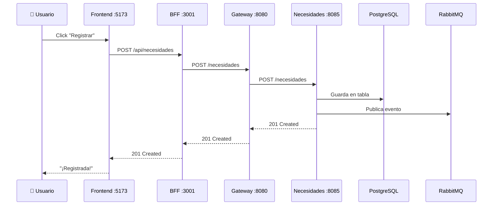

# Flujo de Datos — Plataforma Donatón

Guía simple de cómo viajan los datos en el proyecto y dónde está cada cosa.

---

## 🗺️ Resumen Visual

```
👤 Usuario clickea en el Frontend
        ↓
🖥️ Frontend (React :5173)        → frontend/src/pages/NecesidadesPage.jsx
        ↓ fetch a localhost:3001
🔌 BFF (Node.js :3001)            → bff/index.js
        ↓ axios a localhost:8080
🚪 Gateway (Spring :8080)         → services/gateway/.../application.properties
        ↓ redirige a localhost:8085
🆘 Microservicio (Spring :8085)   → services/necesidades/.../controller/ → service/ → repository/
        ↓ guarda
🗄️ PostgreSQL (:5436)            → tabla "necesidad"
        ↓ publica evento
🐰 RabbitMQ (:5672)              → exchange "donaton.exchange"
```

---

## 📁 Archivos Clave por Capa

### 1. Frontend (React)

| Qué hace | Archivo |
|---|---|
| Rutas definidas | `frontend/src/main.jsx` |
| Layout + sidebar | `frontend/src/App.jsx` |
| Sidebar con links | `frontend/src/components/AdminSidebar.jsx` |
| Página de Necesidades | `frontend/src/pages/NecesidadesPage.jsx` |

> El frontend hace `fetch('http://localhost:3001/api/necesidades')` — siempre al BFF, nunca directo al backend.

---

### 2. BFF (Node.js)

| Qué hace | Archivo |
|---|---|
| Todas las rutas proxy | `bff/index.js` |

> El BFF recibe `/api/necesidades` y lo reenvía como `/necesidades` al Gateway en el puerto 8080.

---

### 3. API Gateway (Spring Cloud Gateway)

| Qué hace | Archivo |
|---|---|
| Rutas a microservicios | `services/gateway/src/main/resources/application.properties` |
| Fallbacks | `services/gateway/.../controller/FallbackController.java` |

> El Gateway ve que el path es `/necesidades/**` y lo redirige a `http://necesidades:8085`. Si el servicio está caído, responde con el fallback.

---

### 4. Microservicio de Necesidades (Spring Boot)

| Qué hace | Archivo |
|---|---|
| Endpoints REST | `services/necesidades/.../controller/NecesidadController.java` |
| Lógica de negocio | `services/necesidades/.../service/NecesidadService.java` |
| Consultas a la BD | `services/necesidades/.../repository/NecesidadRepository.java` |
| Entidad (tabla) | `services/necesidades/.../model/Necesidad.java` |
| Config de RabbitMQ | `services/necesidades/.../config/RabbitMQConfig.java` |
| Propiedades (puerto, BD) | `services/necesidades/src/main/resources/application.properties` |

---

### 5. Docker

| Qué hace | Archivo |
|---|---|
| Todos los contenedores | `docker-compose.yml` |
| Build del microservicio | `services/necesidades/Dockerfile` |

---

## 🌐 Puertos

| Servicio | Puerto |
|---|---|
| Frontend | 5173 |
| BFF | 3001 |
| Gateway | 8080 |
| Donaciones | 8081 |
| Inventario | 8082 |
| Logística | 8083 |
| Auth | 8084 |
| **Necesidades** | **8085** |
| RabbitMQ | 5672 |
| RabbitMQ UI | 15672 |

---

## 🔄 Ejemplo: Crear una Necesidad



---

## 🔒 Circuit Breaker (en simple)

Si RabbitMQ se cae, el Circuit Breaker evita que el microservicio también se rompa. La necesidad se guarda igual en la BD, solo no se envía el evento. Cuando RabbitMQ vuelva, el circuito se recupera automáticamente.

Configurado en: `services/necesidades/src/main/resources/application.properties`
