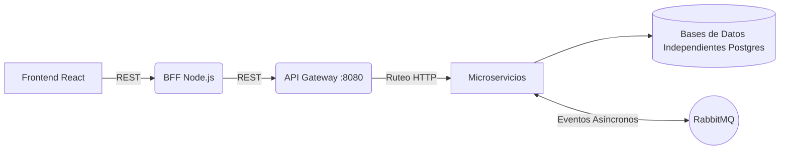

# 🌟 Proyecto Donatón - Plataforma Humanitaria de Microservicios

Donatón es una plataforma tecnológica integral orientada a la gestión y logística de ayuda humanitaria. El ecosistema cuenta con una sólida arquitectura de **Microservicios (Spring Boot)**, alta tolerancia a fallos mediante un bus de eventos asíncrono (**RabbitMQ**), una capa agregadora **BFF (Node.js)**, y un moderno **Frontend reactivo (Vite + React)**.

---

## 🏗 Arquitectura del Sistema

El proyecto implementa *Clean Architecture* e integración orientada a eventos (*Event-Driven Architecture*), asegurando alta disponibilidad y escabilidad horizontal:



* **Microservicios Core (x5):** Autenticación, Donaciones, Inventario, Logística, Necesidades.
* **Persistencia:** Bases de datos PostgreSQL (Aislamiento fuerte: 1 BD autónoma por microservicio).
* **Caching & Message Broker:** Memoria en Redis y Cola de Mensajes en RabbitMQ.

---

## 💻 Manual de Despliegue en Windows (How-To Run)

Sigue estos pasos para compilar todo el ecosistema y ejecutarlo de forma impecable desde tu terminal en Windows.

### 📋 Requisitos Previos

Asegúrate de contar con lo siguiente en tu entorno Windows:
1. **Docker Desktop:** v4.x o superior. *(Debe estar iniciado y el ícono de la ballena activo en la barra de tareas)*.
2. **Java (JDK):** Versión 17. (Agregado a tu variable de entorno `PATH`).
3. **Apache Maven:** Versión 3.8 o superior. (Agregado al `PATH`).
4. **Node.js:** Versión 18+ o 20+.
5. **Git:** Versión 2.x.

### 🔑 Variables de Entorno

El sistema usa credenciales por defecto. Si necesitas personalizarlas en el entorno de desarrollo, deberás sobrescribir las siguientes variables en tus comandos o inyectarlas en tu entorno:
* `DB_PASSWORD` (Por defecto: `admin123`)
* `DB_AUTH_PASSWORD` (Por defecto: `1234`)
* `JWT_SECRET` (Por defecto: `esta_es_una_clave_secreta_muy_larga_y_segura_dev_only_123456`)

---

### 🚀 Paso 1: Clonar y Compilar el Backend (Terminal PowerShell)

Abre **PowerShell** y ejecuta la compilación de todos los microservicios omitiendo temporalmente los tests (ya que asumen BD viva):

```powershell
# 1. Clonar el repositorio
git clone <URL_DEL_REPOSITORIO>
cd donaton

# 2. Compilar microservicios
Push-Location services\authservice;   mvn clean package -DskipTests -q; Pop-Location
Push-Location services\donaciones;    mvn clean package -DskipTests -q; Pop-Location
Push-Location services\gateway;       mvn clean package -DskipTests -q; Pop-Location
Push-Location services\inventario;    mvn clean package -DskipTests -q; Pop-Location
Push-Location services\logistica;     mvn clean package -DskipTests -q; Pop-Location
Push-Location services\necesidades;   mvn clean package -DskipTests -q; Pop-Location
```

### 🐳 Paso 2: Levantar la Infraestructura Backend (Docker)

En la misma consola (ubicado en la raíz `donaton\`), inicializa el ecosistema Docker:

```powershell
# Levanta BDs, RabbitMQ, Redis, Gateway y Microservicios.
docker compose up -d --build
```
> **Tip:** Ejecuta `docker ps` para asegurarte que los 13 contenedores están "Up" (Corriendo).

### 🛠 Paso 3: Levantar el Backend For Frontend (Node.js)

Abre una **NUEVA pestaña** de PowerShell, navega a la raíz del proyecto y corre el BFF:

```powershell
cd bff
npm install
npm run dev
```
*(Mantén esta pestaña abierta. Mostrará que corre en `http://localhost:3001`)*

### 🎨 Paso 4: Levantar la Interfaz Web (React)

Abre otra **NUEVA pestaña** de PowerShell, navega a la raíz del proyecto y corre el Frontend:

```powershell
cd frontend
npm install
npm run dev
```
*(Mantén esta pestaña abierta. Accede a la plataforma en `http://localhost:5173`)*

---

## 🧪 Ejecutar los Tests Automatizados en Windows

Para correr la suite de testing unitario y validar el correcto funcionamiento de las capas de negocio:

```powershell
# Desde la raíz del proyecto, ejecuta:
Push-Location services\donaciones; mvn test -Dtest="*Test" -q; Pop-Location
Push-Location services\inventario; mvn test -Dtest="*Test" -q; Pop-Location
Push-Location services\logistica;  mvn test -Dtest="*Test" -q; Pop-Location
Push-Location services\necesidades; mvn test -Dtest="*Test" -q; Pop-Location
```

---

## 🌐 Recursos, Puertos y Accesos

| Recurso | URL |
|---|---|
| **Plataforma Web (Frontend)** | http://localhost:5173 |
| **BFF Endpoint Base** | http://localhost:3001/api |
| **RabbitMQ Manager** | http://localhost:15672 |

*(Credenciales RabbitMQ: `guest` / `guest`)*
*(Credenciales de prueba Admin Web: `admin@administrador.cl` / `admin123`)*

### 📖 Swagger UI (Documentación interactiva de cada API)
* **AuthService:** http://localhost:8084/swagger-ui/index.html
* **Donaciones:** http://localhost:8081/swagger-ui/index.html
* **Inventario:** http://localhost:8086/swagger-ui/index.html
* **Logística:** http://localhost:8083/swagger-ui/index.html
* **Necesidades:** http://localhost:8085/swagger-ui/index.html

---

## 🛑 Cómo Apagar el Sistema

Para detener todos los servicios de forma segura y liberar recursos del PC:

```powershell
# En la consola raíz
docker compose down

# Presiona Ctrl + C en las pestañas de BFF y Frontend
```

Para borrar la infraestructura profunda (incluyendo las bases de datos de desarrollo):
```powershell
docker compose down -v
```
